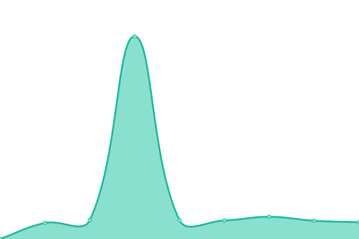

# [📈 Live Status](https://status.ashhhleyyy.dev): <!--live status--> **🟧 Partial outage**

This repository contains the open-source uptime monitor and status page for [Ash](https://ashhhleyyy.dev), powered by [Upptime](https://github.com/upptime/upptime).

With [Upptime](https://upptime.js.org), you can get your own unlimited and free uptime monitor and status page, powered entirely by a GitHub repository. We use [Issues](https://github.com/ashhhleyyy/status-page/issues) as incident reports, [Actions](https://github.com/ashhhleyyy/status-page/actions) as uptime monitors, and [Pages](https://status.ashhhleyyy.dev) for the status page.

<!--start: status pages-->
<!-- This summary is generated by Upptime (https://github.com/upptime/upptime) -->
<!-- Do not edit this manually, your changes will be overwritten -->
<!-- prettier-ignore -->
| URL | Status | History | Response Time | Uptime |
| --- | ------ | ------- | ------------- | ------ |
|  [Website (ashhhleyyy.dev)](https://ashhhleyyy.dev/) | 🟩 Up | [website-ashhhleyyy-dev.yml](https://github.com/ashhhleyyy/status-page/commits/HEAD/history/website-ashhhleyyy-dev.yml) | 

 441ms
     
 | 

<a href="https://status.ashhhleyyy.dev/history/website-ashhhleyyy-dev">100.00%</a>
    

|  [Nucleoid website](https://nucleoid.xyz/) | 🟩 Up | [nucleoid-website.yml](https://github.com/ashhhleyyy/status-page/commits/HEAD/history/nucleoid-website.yml) | 

 684ms
     
 | 

<a href="https://status.ashhhleyyy.dev/history/nucleoid-website">100.00%</a>
    

|  [Nucleoid API](https://api.nucleoid.xyz/stats/stats) | 🟩 Up | [nucleoid-api.yml](https://github.com/ashhhleyyy/status-page/commits/HEAD/history/nucleoid-api.yml) | 

 415ms
     
 | 

<a href="https://status.ashhhleyyy.dev/history/nucleoid-api">100.00%</a>
    

|  [Gitea](https://git.ashhhleyyy.dev/) | 🟩 Up | [gitea.yml](https://github.com/ashhhleyyy/status-page/commits/HEAD/history/gitea.yml) | 

 511ms
     
 | 

<a href="https://status.ashhhleyyy.dev/history/gitea">100.00%</a>
    

|  [Maven](https://maven.ashhhleyyy.dev/) | 🟩 Up | [maven.yml](https://github.com/ashhhleyyy/status-page/commits/HEAD/history/maven.yml) | 

 393ms
     
 | 

<a href="https://status.ashhhleyyy.dev/history/maven">100.00%</a>
    

|  [SSO](https://id.ashhhleyyy.dev/) | 🟥 Down | [sso.yml](https://github.com/ashhhleyyy/status-page/commits/HEAD/history/sso.yml) | 

 386ms
     
 | 

<a href="https://status.ashhhleyyy.dev/history/sso">0.00%</a>
    

|  [Home Assistant](https://ha.ashhhleyyy.dev/) | 🟥 Down | [home-assistant.yml](https://github.com/ashhhleyyy/status-page/commits/HEAD/history/home-assistant.yml) | 

 773ms
     
 | 

<a href="https://status.ashhhleyyy.dev/history/home-assistant">0.00%</a>
    

|  [Nucleoid Minecraft server](nucleoid.xyz) | 🟩 Up | [nucleoid-minecraft-server.yml](https://github.com/ashhhleyyy/status-page/commits/HEAD/history/nucleoid-minecraft-server.yml) | 

 136ms
     
 | 

<a href="https://status.ashhhleyyy.dev/history/nucleoid-minecraft-server">100.00%</a>
    

<!--end: status pages-->

[**Visit our status website →**](https://status.ashhhleyyy.dev)

## 📄 License

- Powered by: [Upptime](https://github.com/upptime/upptime)
- Code: [MIT](./LICENSE) © [Ash](https://ashhhleyyy.dev)
- Data in the `./history` directory: [Open Database License](https://opendatacommons.org/licenses/odbl/1-0/)
